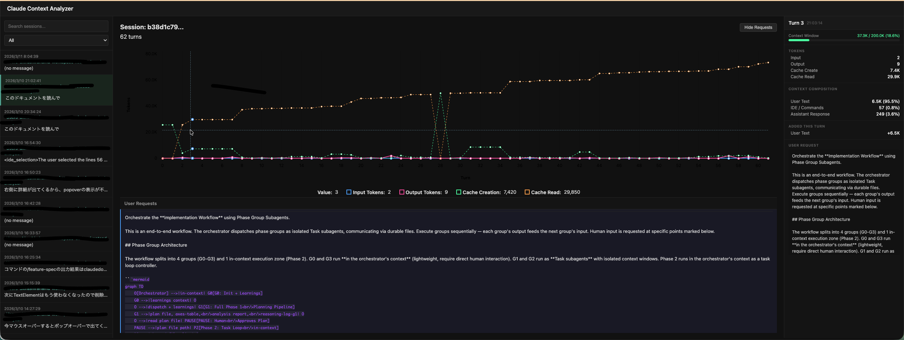

# Claude Context Analyzer

Claude Codeの会話ログ（`~/.claude/projects/` 内のJSONLファイル）を解析し、ターンごとのトークン消費パターンを可視化するWebアプリケーション。



## 機能

- **セッション一覧**: `~/.claude/projects/` 配下のセッションを自動検出・表示
- **トークン使用量チャート**: 入力/出力/キャッシュトークンの推移を時系列グラフで表示（uPlot）
- **コンテキスト内訳**: ユーザーテキスト、ツール結果、システムリマインダー、IDE情報、アシスタント応答、画像ごとの内訳
- **リクエストタイムライン**: 各ターンのユーザーメッセージとトークン使用量を一覧表示
- **ライブポーリング**: アクティブなセッションの変更を自動検出・更新

## セットアップ

```bash
npm install
npm run dev
```

ブラウザで http://localhost:5173 を開く。バックエンドAPIは http://127.0.0.1:4100 で起動し、Viteが自動的にプロキシする。

## スクリプト

| コマンド | 説明 |
|---|---|
| `npm run dev` | サーバー + クライアントを同時起動 |
| `npm run dev:server` | バックエンドのみ（ポート4100） |
| `npm run dev:client` | フロントエンドのみ（ポート5173） |
| `npm run build` | TypeScript型チェック + Viteビルド |
| `npm test` | テスト実行（単発） |
| `npm run test:watch` | テスト実行（ウォッチモード） |
| `npm run typecheck` | 型チェックのみ |

## 技術スタック

- **バックエンド**: [Hono](https://hono.dev/) + Node.js
- **フロントエンド**: React 19 + [uPlot](https://github.com/leeoniya/uPlot)
- **ビルド**: Vite + TypeScript
- **テスト**: Vitest
