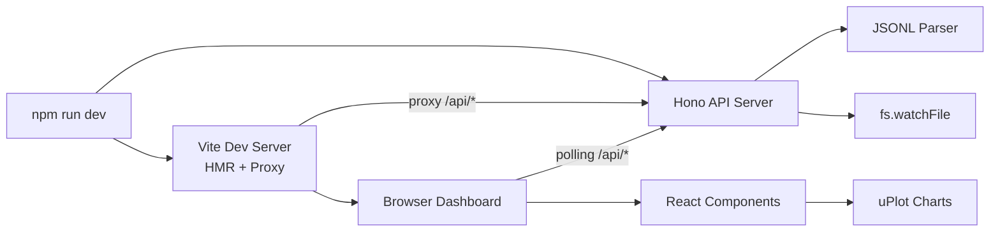

# Claude Context Analyzer

## Overview

Claude Codeのセッションログ（JSONL）を解析し、ターンごとのToken消費推移をブラウザダッシュボードで可視化するCLIツール。開発者がコンテキストウィンドウの消費パターンを定量的に把握し、作業スタイルやプラグイン構成の改善を合理的に判断できるようにする。

## Context and Scope

### 現状の問題

Claude Codeを日常的に使う開発者は、コンテキストウィンドウが何によってどれだけ消費されているかを定量的に把握できない。現状は「なんとなくコンテキストが大きい気がする」という感覚的な判断しかなく、CLAUDE.mdの整理、MCPサーバーの取捨選択、スキル構成の見直しといった改善施策の効果を測定する手段がない。

### データソースの特性

Claude Codeは会話ログを `~/.claude/projects/[encoded-project-path]/[sessionId].jsonl` にJSONL形式で記録している。各アシスタント応答には `message.usage` フィールドとして、そのターンの累積token数（`input_tokens`, `output_tokens`, `cache_creation_input_tokens`, `cache_read_input_tokens` 等）が含まれる。このデータは既に存在しているが、可視化する手段がない。

ファイルサイズはセッションの長さに比例し、短いセッションで数十KB、長時間セッションで数MB〜10MB+になる。フォーマットはClaude Code内部仕様であり、バージョンアップで変更される可能性がある（実際にキャッシュ関連フィールドの追加が観測されている）。

### 既存ツールの限界

Claude Codeエコシステムには既にいくつかの分析ツールが存在する：

- **ccusage**: CLI出力でのtoken集計とコスト計算。日次・月次・セッション単位の表示が可能だが、時系列可視化やインタラクティブな操作はできない
- **clog**: ブラウザベースのログビューア。会話のスレッド表示とtoken数表示が可能だが、時系列チャートや分析機能はない
- **Claude-Code-Usage-Monitor**: ターミナルUIでのリアルタイム監視。統計予測モデルを含むが、ブラウザダッシュボードではない

いずれのツールも「ターンごとのtoken消費がどう推移したか」を時系列チャートでインタラクティブに分析する機能を提供していない。本ツールの主な利用場面は**ポストホック分析**（セッション終了後に「どのターンでコンテキストが膨張したか」を振り返る）であり、副次的にアクティブセッションのライブ監視にも対応する。

### 想定ワークフロー

開発者がこのツールを使う典型的なシナリオは以下の通り：

1. **ポストホック分析（主要ユースケース）**: セッション後に「コンテキストが早く埋まった」「動作が遅くなった」と感じた時、どのターンでinput_tokensが急増したかを確認し、原因（大きなファイル読み込み、長いツール結果等）を特定する
2. **構成変更の効果測定**: CLAUDE.mdやMCPプラグインの構成を変更した前後のセッションを比較し、改善効果を定量的に評価する
3. **ライブ監視（副次的）**: アクティブセッション中にダッシュボードを開き、リアルタイムでToken消費を観察する

ポストホック分析が主要ユースケースであることは、アーキテクチャ判断に影響する。ライブ更新は必要だが、そのためにアーキテクチャ全体を複雑化する必要はない。

## Goals / Non-Goals

### Goals

- セッション内のToken推移（input_tokens, output_tokens, cache関連metrics）を時系列折れ線グラフで可視化する
- ファイル変更監視によるライブ更新ダッシュボードを提供し、変更から5秒以内に反映する
- グラフ上のデータポイントクリックで、対応するユーザーリクエスト内容をポップアップ表示する
- セッション一覧画面で日時フィルタ、セッションプレビュー（最初のユーザーメッセージ要約）を提供する
- セッション一覧のキーワード検索はv1ではメタデータ（最初のユーザーメッセージ）を対象とする。全ユーザーメッセージの全文検索はv2で検討する
- 10MB以上のJSONLファイルでも初期読み込みが10秒以内に完了する
- 壊れた行・不明なレコード型をスキップし、エラーカウントをUI上に表示する

### Non-Goals

- コンポーネント別のToken内訳推定（「CLAUDE.mdが何token」等）— ログにはターン全体のtoken数しか記録されておらず、コンポーネント単位の分離はv1では技術的に不可能
- コスト計算 — ccusageが既にこの機能を提供しており、本ツールはtoken推移の可視化に特化する。ただし、データモデルにはモデル情報（`message.model`）を保持し、v2でコスト計算を追加できる拡張性を確保する
- 複数セッション横断の日次/週次トレンド分析 — v2で検討
- サブエージェント（`subagents/*.jsonl`）のデータ統合表示 — v2で検討
- Claude Code本体への変更やフック
- Token消費の最適化提案や自動改善
- 認証・マルチユーザー対応

## Proposal

### 概要

React + TypeScript + Viteでダッシュボードを構築し、HonoベースのAPIサーバーと組み合わせる。開発時は `npm run dev` でVite dev server（フロントエンド、HMR付き）とHono server（API）を同時に起動する。Viteのproxy設定で `/api/*` リクエストをHonoに転送する。

配布方式は段階的に決定する。v1ではリポジトリをcloneして `npm run dev` で起動する開発者向けワークフロー。安定した段階で `vite build` によるプリビルド済みバンドルをnpmパッケージに含め、`npx claude-context-analyzer` での配布に移行する。

### 主要設計判断

**なぜuPlotか** — 本ツールの中核は時系列データの可視化であり、uPlotはまさにこの用途に特化している。バンドルサイズ50KB（Chart.jsの203KBに対して約1/4）で、Canvas描画により1000+データポイントでも60fpsで描画可能。ドキュメントの薄さ（デモとTypeScript型定義が主な情報源）はトレードオフだが、我々のユースケースは時系列折れ線グラフという最も基本的な用途であり、公式デモで十分にカバーされている。ただし、カスタムツールチップ実装でuPlotが障壁になった場合のChart.jsへの切り替えコスト（1-2週間のチャート関連コード書き直し）はリスクとして認識しておく。実装開始2週間以内にクリック→詳細表示のプロトタイプを作成し、uPlotで実現可能であることを確認する。

**なぜPollingか** — ダッシュボードのライブ更新は「ファイルが変更されたら5秒以内に反映」という要件であり、3秒間隔のPolling（`setInterval` + `fetch`）で十分に達成できる。SSE（Server-Sent Events）も検討したが、ローカルツールにおいてSSEの利点（自動再接続、プッシュ意味論）はPollingに対して十分な差別化要因とならない。Pollingの方がサーバー側のコネクション管理が不要で実装がシンプルである。

**なぜfs.watchFileか** — 本ツールが監視するのは特定の既知のJSONLファイル（1-2ファイル）であり、ディレクトリの再帰的監視は不要である。`fs.watchFile` はNode.js組み込みのポーリングベースファイル監視で、プラットフォーム間の動作差異がなく信頼性が高い。chokidarは汎用的なファイル監視には優れるが、単一ファイルの監視には外部依存として過剰である。

**なぜ全ファイル読み込み + 増分追加か** — v1ではJSONLファイル全体を初期読み込みし、メモリ上にパース結果をキャッシュする。Node.jsで10MBのファイルを読み込んでJSONLをパースする処理は1秒未満で完了する。ライブ更新時はファイルサイズの増加を検知し、増加分（新規追加行）のみを読み取って既存のキャッシュに追加する。この方式はストリーミング解析より実装がシンプルであり、v1のファイルサイズ（大半が数MB、最大10MB程度）では十分に実用的。ファイルサイズが50MB+になりストリーミングが必要になった場合に、この判断を再検討する。

**なぜ防御的解析か** — JSONLフォーマットはClaude Codeの内部仕様であり、安定性の保証がない。実際にキャッシュ関連フィールド（`cache_creation.ephemeral_5m_input_tokens`等）の追加が観測されている。全フィールドをoptional chainingとデフォルト値で扱い、未知のフィールドは無視する。必須フィールド（`type`, `timestamp`）が欠落したレコードはスキップし、スキップ数をUIに表示する。加えて、**サニティチェック**として以下を実装する：セッション内でusageデータが1件も見つからない場合、または`input_tokens`が全ターンでゼロの場合は、フォーマット変更の可能性を示す警告をダッシュボードに表示する。これにより、防御的解析の「静かに失敗する」リスクを軽減する。

**なぜReact + Viteか** — ダッシュボードのコア状態（セッションデータ、選択状態、フィルタ条件）自体はシンプルだが、UIとしてはセッション一覧のフィルタリング、ポップアップの表示/非表示/位置管理、チャートとリストの連動、エラー表示など、DOM操作の細かい調整が多い。Reactのコンポーネントモデルとフック（useState、useEffect）により、これらのUI状態を宣言的に管理できる。Viteは開発時のHMR（変更即反映）を提供し、UIの微調整を高速に繰り返せる。配布時は `vite build` でプリビルド済みバンドルを生成し、npmパッケージに含めることで `npx` 体験も維持できる。

### セッション検索の設計

50以上のセッションから目的のセッションを素早く見つけるために、以下の検索機能を提供する：

- **メタデータの事前抽出**: サーバー起動時に各セッションJSONLの先頭数行のみを読み取り、開始時刻と最初のユーザーメッセージ（先頭100文字）を抽出する。全行を解析する必要はなく、起動時間への影響は最小限
- **キーワード検索（v1）**: 事前抽出したメタデータ（最初のユーザーメッセージ）を対象とした文字列マッチング。50セッションのメタデータ検索は即座に完了する
- **日時フィルタ**: 最初のレコードのtimestampで日付範囲フィルタリング

## Alternatives Considered

### VSCode Extension

ターゲットユーザー（Claude Code利用者）はVSCode内で作業していることが多く、拡張機能なら直接リーチできる。マーケットプレイスによる自動更新も魅力的。しかし、VSCode Webview APIの制約によりダッシュボードUIの柔軟性が制限される（外部ライブラリの読み込み、レイアウトの自由度等）。また、VSCodeに依存しないスタンドアロンのCLIツールとして提供することで、エディタを問わずClaude Codeユーザー全般をカバーできる。v2でVSCode拡張への発展を検討する。VSCode Webviewの制約がツールの分析UIの表現力を制限する場合に、この判断を再検討する。

### Chart.js

最も広く使われているJavaScriptチャートライブラリで、ドキュメントとコミュニティが充実している。Vite + tree-shakingを使えばバンドルサイズを削減できるが、uPlotの方が時系列データに特化しており描画パフォーマンスで優位。uPlotのドキュメント不足が実装の障壁になった場合、またはReactとの統合でカスタムツールチップ実装が困難な場合に再検討する。

### SSE（Server-Sent Events）

サーバー→ブラウザの一方向プッシュでEventSource APIの自動再接続を提供する。しかし、ローカルツールで3秒間隔のPollingとの体験差はほぼなく、サーバー側のSSEストリーム管理が不要なPollingの方がシンプル。ライブ更新の即時性が重要になった場合（例：サブエージェント統合で高頻度更新が必要になった場合）に再検討する。

### WebSocket

双方向通信が可能だが、一方向pushで十分なユースケースに対してオーバーエンジニアリング。ブラウザ→サーバーのリクエストが頻繁に必要になった場合に再検討する。

### Vanilla JS（ビルドステップなし）

フレームワークなし、ビルドステップなしで最も軽量な配布が可能。しかし、セッション一覧のフィルタリング、ポップアップ状態管理、チャートとの連動など、細かいUI調整を素のDOM操作で管理するとコードの保守性が低下する。UIの複雑さが当初想定より大きいことが判明したため、Reactのコンポーネントモデルを採用した。UIが極度にシンプルなツール（チャート1枚のみ等）であれば、この選択肢が適切。

### chokidar

汎用的なファイル監視ライブラリとして業界標準だが、特定の1-2ファイルの監視には外部依存として過剰。Node.js組み込みの`fs.watchFile`で十分。ディレクトリの再帰的監視が必要になった場合（例：subagentsディレクトリ監視）に再検討する。

### ストリーミング解析

メモリ効率に優れるが、v1のファイルサイズ（大半が数MB）では全読み込みで十分。実装の複雑さ（バイトオフセット管理、不完全行バッファリング）がv1には過剰。50MB以上のファイルを頻繁に扱うことが判明した場合に再検討する。

### http.createServer（素のNode.js）

外部依存ゼロで最も軽量だが、ルーティング、静的ファイル配信、JSONレスポンスをすべて自前で実装する必要がある。Honoはこれらを最小限のオーバーヘッドで提供し、コードの保守性を向上させる。Honoの依存が問題になった場合に再検討する。

### 厳格スキーマ検証（Zodなど）

型安全な解析を提供するが、Claude CodeのJSONLフォーマットは内部仕様であり変更が実際に発生している。厳格なスキーマはフォーマット変更の度にツールが即座に破損する。防御的解析にサニティチェック（usageデータの存在確認）を組み合わせることで、「静かに失敗する」リスクも軽減できる。フォーマットが安定しAPIドキュメントが公開された場合に再検討する。

## Cross-Cutting Concerns

### セキュリティ

セッションログにはユーザーが入力したメッセージが含まれており、APIキー、プロプライエタリコード、内部パスなどの機密情報が含まれる可能性がある。以下の対策を講じる：

- HTTPサーバーは `127.0.0.1` のみにバインドし、ネットワーク上の他のデバイスからアクセスできないようにする
- 開発時は固定ポート（Vite: 5173、API: 3001）を使用。npm配布時はランダムポートを使用し、ポート番号の予測を困難にする
- ファイルアクセスは `~/.claude/projects/` 配下に限定し、パストラバーサルを防止する
- APIレスポンスでユーザーメッセージ内容を返す際は、HTMLエスケープを施しContent-Typeを`application/json`に設定する。ユーザーメッセージにはコードやHTML断片が含まれる可能性があり、エスケープなしでブラウザに表示するとXSSベクタとなりうる
- HTTPS（自己署名証明書）は導入しない — ローカルツールとしてはオーバーエンジニアリングであり、証明書の信頼設定がユーザー体験を損なう

### パフォーマンス

- 初期読み込みはファイル全体を読み込んでパースし、結果をメモリにキャッシュする。10MBのJSONLで1秒未満
- ライブ更新時はファイルサイズ増加分のみを読み取り、キャッシュに追加する
- uPlotのCanvas描画で1000+データポイントでも60fpsを維持
- セッション一覧のメタデータは先頭数行のみの読み取りで抽出し、起動時間を最小化

## Concerns

### JSONLフォーマットの安定性

最大のリスク。Claude Codeの内部仕様であり、バージョンアップで予告なく変更される可能性がある。防御的解析と未知フィールドの無視で対処するが、根本的な構造変更（例：`message.usage` の位置変更）には対応できない。サニティチェック（usageデータの存在確認、input_tokensの単調増加確認）により、構造変更を検出して警告を表示する。完全な対処にはツールのバージョンアップが必要。

### uPlotのドキュメント不足

公式ドキュメントは薄く、学習は主にデモソースコードとTypeScript型定義から行う必要がある。基本的な時系列折れ線グラフはデモでカバーされているが、カスタムツールチップやクリック→詳細表示の実装で想定外の時間がかかる可能性がある。**判断期限：実装開始2週間以内にクリック→詳細表示のプロトタイプを作成し、uPlotで実現可能か判断する。** 不可の場合はChart.jsへの切り替え（1-2週間の書き直し）を実行する。

### ライブ更新中の競合

Claude Codeがアクティブにログを書き込んでいる最中にファイルを読み取るため、不完全な行を読む可能性がある。増分読み取り時に改行文字で終わらないデータは次回のポーリングまで保留し、完全な行として処理する。

### セッション数の増加

長期間使用すると `~/.claude/projects/` 配下に数百のセッションファイルが蓄積される。v1のセッション一覧は日時フィルタで絞り込みを提供するが、UIレベルでの仮想スクロールやページネーションはv2で検討する。

## Review Checklist

- [ ] Architecture approved
- [ ] Security implications reviewed
- [ ] Performance impact assessed
